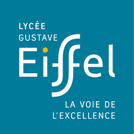

<head>
    <title>CV de Clément Mansué</title>
    <meta charset="utf-8">
    <meta name="viewport"
          content="width=device-width, initial-scale=1, user-scalable=no">
    <link rel="stylesheet" href="cssCV.css">
</head>
<body>
    <header>
        <h1>CV de Clément Mansué</h1>
    </header> 
    <section>
        

            
        

        

            <h2>Qui suis-je ?</h2>
            
Actuellement en seconde année en DUT Informatiques à l'IUT A de Lille, ...

            <a href="CV_Clement_Mansue.pdf" download="CV-Clement_Mansue">Télécharger mon CV</a>
        

        

            <h2>Informations de contact</h2>
            

                
Nom : 

                
MANSUE Clément

            

            

                
Adresse : 

                
141 rue Jeanne d'Arc, 59280 Armentières

            

            

                
Téléphone :

                
06 24 85 50 50

            

            

                
Mail : 

                
<a href="mailto:clement.mansue@gmail.com">clement.mansue@gmail.com</a>

            

            

                
                
                
            

        

    </section>
    <section>
        <h2>Expériences professionnelles</h2>
        

            

                
            

            

                <h3>Stagiaire au rayon boulangerie</h3>
                <h4>Supermarché MATCH</h4>
                <h4>Decembre 2016 - Decembre 2016</h4>
            

            

                
J'aidais à la confection du pain, je mettais en rayon les produits et je servais la clientèle, ce stage m'as permis de connaître le contact client.

            

        

    </section>
    <section>
        <h2>Formation</h2>
        

            

                
            

            

                <h3>Bac STI2D option SIN</h3>
                <h4>2017 - 2020</h4>
            

            

                
J'ai obtenu mon baccalauréat STI2D option Système Informatique et Numérique avec la mention Bien

            

        

        

            

                
            

            

                <h3>Brevet des collèges</h3>
                <h4>2013 - 2017</h4>
            

            

                
J'ai obtenu mon brevet des collèges avec la mention Bien

            

        

    </section>
    <section>
        <h2>Compétences</h2>
        <h3 class="h3gauche">Professionnelles</h3>
        

            
HTML / CSS

        

        

            
QBE / SQL

        

        

            
Java

        

        

            
C

        

        <h3 class="h3gauche">Personnelles</h3>
        

            
Créativité

        

        

            
Adaptation

        

        

            
Sérieux

        

        

            
Pédagogie

        

    </section>
    <section>
        <h2>Centres d'intérêt</h2>
        <figure class="interet">
            
            <figcaption>Musique</figcaption>
        </figure>
        <figure class="interet">
            
            <figcaption>Jeux vidéos</figcaption>
        </figure>
        <figure class="interet">
            
            <figcaption>Manga</figcaption>
        </figure>
    </section>
    <footer>
        
<a href="https://www.pierre-giraud.com">©Pierre Giraud</a> 2020

		
Modifié par MANSUE Clément

    </footer> 
</body>
 
